# Clarion Language - Railroad Diagrams

Generated from `clarion_parser.pl` DCG rules.

## control_decl

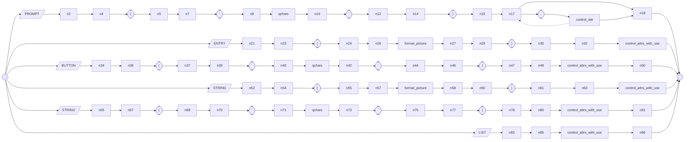

## expr

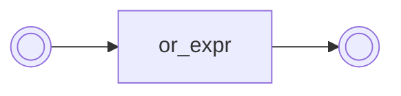

## field_decl

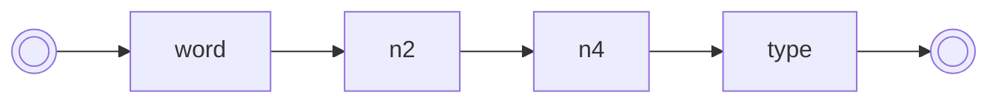

## map_block

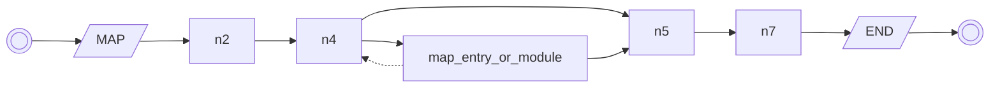

## map_entry_or_module

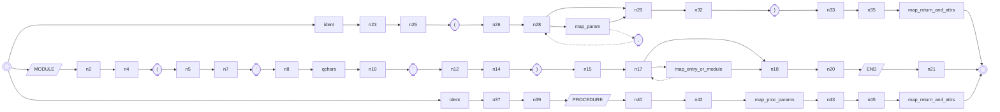

## procedure

```mermaid
flowchart LR
    n0(((" ")))
    n1(((" ")))
    n12["return_type"]
    n15["local_var"]
    n18[/"CODE"/]
    n20["statements"]
    n3["ident"]
    n6[/"PROCEDURE"/]
    n9["proc_def_params"]
    n0 --> n3 --> n2
    n10 --> n12 --> n11
    n11 --> n13
    n13 --> n14
    n13 --> n15 --> n14
    n14 --> n16
    n15 -.-> n13
    n16 --> n18 --> n17
    n17 --> n19
    n19 --> n20 --> n1
    n2 --> n4
    n4 --> n6 --> n5
    n5 --> n7
    n7 --> n9 --> n8
    n8 --> n10
```

## program

```mermaid
flowchart LR
    n0(((" ")))
    n1(((" ")))
    n10([")"])
    n13["top_decls"]
    n16["map_block"]
    n19["procedures"]
    n22[/"PROGRAM"/]
    n25["map_block"]
    n28["top_decls"]
    n31[/"CODE"/]
    n34["statements"]
    n37["procedures"]
    n4[/"MEMBER"/]
    n7(["("])
    n0 --> n2
    n0 --> n20
    n11 --> n13 --> n12
    n12 --> n14
    n14 --> n16 --> n15
    n15 --> n17
    n17 --> n19 --> n18
    n18 --> n1
    n2 --> n4 --> n3
    n20 --> n22 --> n21
    n21 --> n23
    n23 --> n25 --> n24
    n24 --> n26
    n26 --> n28 --> n27
    n27 --> n29
    n29 --> n31 --> n30
    n3 --> n5
    n30 --> n32
    n32 --> n34 --> n33
    n33 --> n35
    n35 --> n37 --> n36
    n36 --> n1
    n5 --> n7 --> n6
    n6 --> n8
    n8 --> n10 --> n9
    n9 --> n11
```

## routine

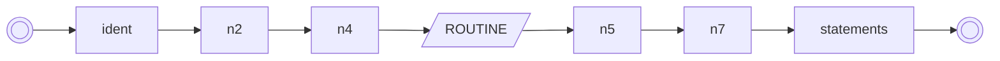

## statement

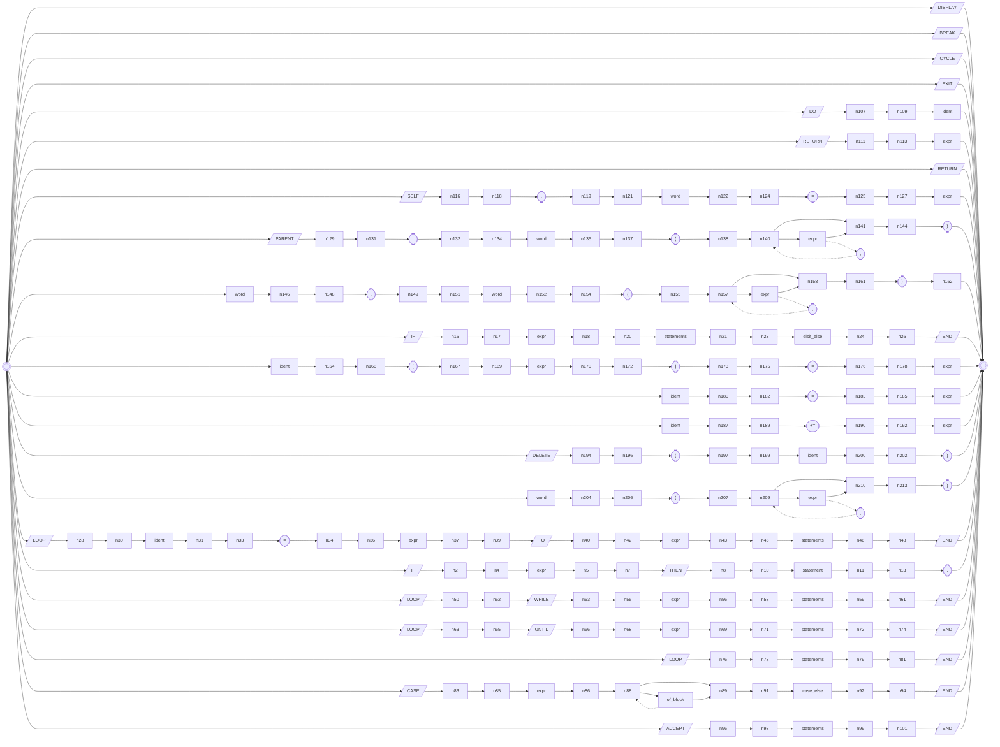

## top_decl_item

```mermaid
flowchart LR
    n0(((" ")))
    n1(((" ")))
    n101[/"DIM"/]
    n104(["("])
    n107["number"]
    n109([")"])
    n10["file_attrs"]
    n111["ident"]
    n114["type"]
    n117(["("])
    n120["number"]
    n122([")"])
    n13["key_decls"]
    n16["record_block"]
    n19[/"END"/]
    n21["ident"]
    n24[/"GROUP"/]
    n28["group_attrs"]
    n31["field_list"]
    n33[/"END"/]
    n35["ident"]
    n38[/"QUEUE"/]
    n3["ident"]
    n42["field_list"]
    n44[/"END"/]
    n46["word"]
    n49[/"CLASS"/]
    n53["class_parent"]
    n56["class_attrs"]
    n59["class_member"]
    n61[/"END"/]
    n63["ident"]
    n66[/"WINDOW"/]
    n6[/"FILE"/]
    n70(["("])
    n73(["'"])
    n75["qchars"]
    n77(["'"])
    n80([")"])
    n83([","])
    n84["window_attr"]
    n87["control_decl"]
    n90[/"END"/]
    n92["ident"]
    n95["type"]
    n98([","])
    n0 --> n111 --> n110
    n0 --> n21 --> n20
    n0 --> n3 --> n2
    n0 --> n35 --> n34
    n0 --> n46 --> n45
    n0 --> n63 --> n62
    n0 --> n92 --> n91
    n100 --> n102
    n102 --> n104 --> n103
    n103 --> n105
    n105 --> n107 --> n106
    n106 --> n108
    n108 --> n109 --> n1
    n11 --> n13 --> n12
    n110 --> n112
    n112 --> n114 --> n113
    n113 --> n115
    n115 --> n1
    n115 --> n117 --> n116
    n116 --> n118
    n118 --> n120 --> n119
    n119 --> n121
    n12 --> n14
    n121 --> n122 --> n1
    n14 --> n16 --> n15
    n15 --> n17
    n17 --> n19 --> n18
    n18 --> n1
    n2 --> n4
    n20 --> n22
    n22 --> n24 --> n23
    n23 --> n25
    n25 --> n26
    n26 --> n28 --> n27
    n27 --> n29
    n29 --> n31 --> n30
    n30 --> n32
    n32 --> n33 --> n1
    n34 --> n36
    n36 --> n38 --> n37
    n37 --> n39
    n39 --> n40
    n4 --> n6 --> n5
    n40 --> n42 --> n41
    n41 --> n43
    n43 --> n44 --> n1
    n45 --> n47
    n47 --> n49 --> n48
    n48 --> n50
    n5 --> n7
    n50 --> n51
    n51 --> n53 --> n52
    n52 --> n54
    n54 --> n56 --> n55
    n55 --> n57
    n57 --> n58
    n57 --> n59 --> n58
    n58 --> n60
    n59 -.-> n57
    n60 --> n61 --> n1
    n62 --> n64
    n64 --> n66 --> n65
    n65 --> n67
    n67 --> n68
    n68 --> n70 --> n69
    n69 --> n71
    n7 --> n8
    n71 --> n73 --> n72
    n72 --> n75 --> n74
    n74 --> n77 --> n76
    n76 --> n78
    n78 --> n80 --> n79
    n79 --> n81
    n8 --> n10 --> n9
    n81 --> n82
    n81 --> n83 --> n84 --> n82
    n82 --> n85
    n84 -.-> n81
    n85 --> n86
    n85 --> n87 --> n86
    n86 --> n88
    n87 -.-> n85
    n88 --> n90 --> n89
    n89 --> n1
    n9 --> n11
    n91 --> n93
    n93 --> n95 --> n94
    n94 --> n96
    n96 --> n98 --> n97
    n97 --> n99
    n99 --> n101 --> n100
```

## type

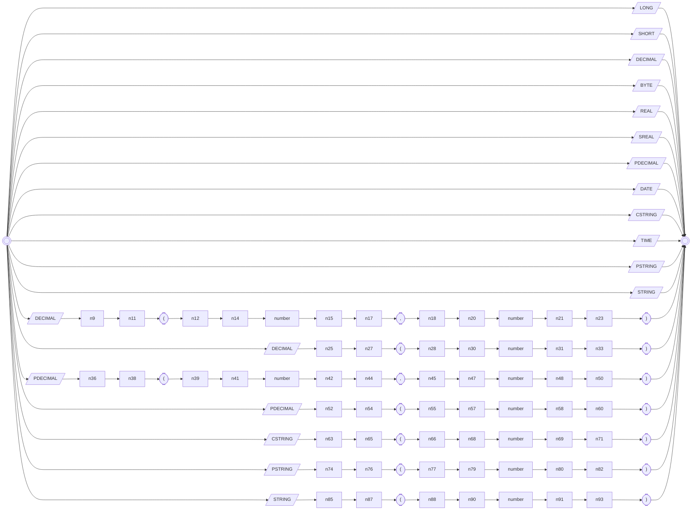

## window_attr

```mermaid
flowchart LR
    n0(((" ")))
    n1(((" ")))
    n12([","])
    n15["opt_number"]
    n18([","])
    n21["number"]
    n24([","])
    n27["number"]
    n29([")"])
    n30[/"CENTER"/]
    n3[/"AT"/]
    n6(["("])
    n9["opt_number"]
    n0 --> n3 --> n2
    n0 --> n30 --> n1
    n10 --> n12 --> n11
    n11 --> n13
    n13 --> n15 --> n14
    n14 --> n16
    n16 --> n18 --> n17
    n17 --> n19
    n19 --> n21 --> n20
    n2 --> n4
    n20 --> n22
    n22 --> n24 --> n23
    n23 --> n25
    n25 --> n27 --> n26
    n26 --> n28
    n28 --> n29 --> n1
    n4 --> n6 --> n5
    n5 --> n7
    n7 --> n9 --> n8
    n8 --> n10
```

